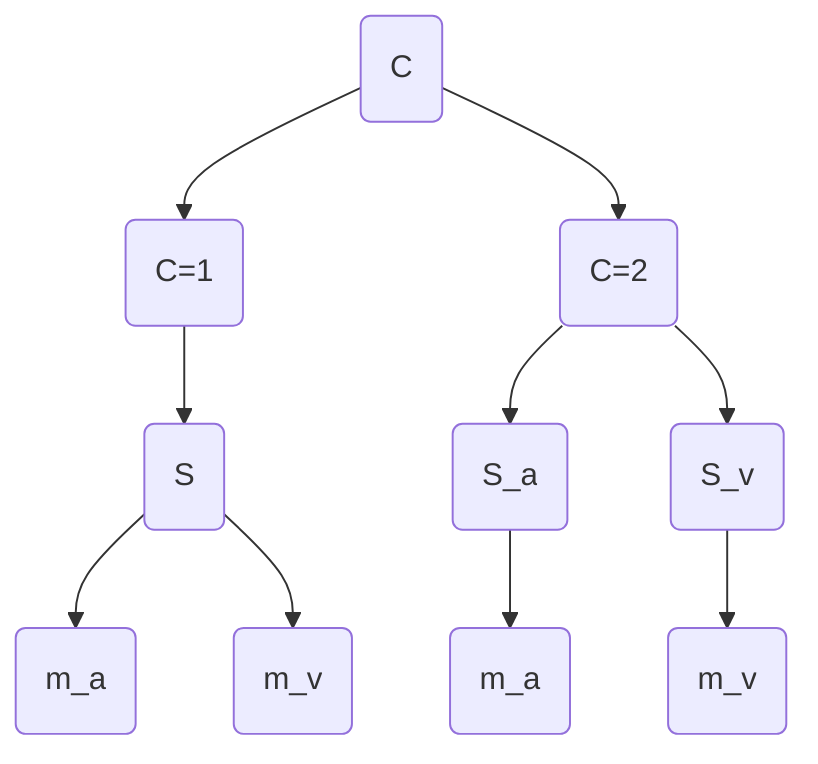

# Model Coding:

Created: June 18, 2025 6:09 PM  
Tags: article note

# 1- Unimodal

### 1.1 Measurement


$$
m=N(s,\sigma^2)
$$

```python
# unimodal measurements
def unimodalMeasurements(sigma, S):
    # P(x|s) # generate measurements from a normal distribution
    m = np.random.normal(S, sigma**2, 10000)  # true duration is S seconds
    return m

```

### **1.2 Likelihood**

$$
p(m|s)=\frac{1}{\sqrt{2\pi} \sigma}\exp(-\frac{(m-s)^2}{2\sigma^2})
$$

```python
def gaussianPDF(m,s,sigma):
    return (1/(np.sqrt(2*np.pi)*sigma))*np.exp(-((x-s)**2)/(2*(sigma**2)))

# likelihood function
def likelihood(S, sigma):
    # P(m|s) # likelihood of measurements given the true duration
    m=np.linspace(S - 4*sigma, S + 4*sigma, 500)
    p_x=gaussianPDF(m,S,sigma)
    return x, p_x

```

1.2.1 **Plot Likelihoods analytically**

```python
def plotLikelihood(S,sigma):
    x, p_x = likelihood(S, sigma)
    plt.plot(x, p_x, label='Likelihood Function')
    plt.xlabel('Measurement $m$')
    plt.ylabel('Probability Density')
    plt.title('Analytical Likelihood $P(m|s)$')
    plt.legend()
    
def plotMeasurements(sigma, S):
    m = unimodalMeasurements(sigma, S)
    plt.hist(m, bins=50, density=True, alpha=0.5, label='Measurements Histogram')
    plt.xlabel('Measurement $m$')
    plt.ylabel('Density')
    plt.title('Unimodal Measurements Histogram')
    plt.legend()      

```


---

# 2 Bimodal



---

## 2.1 Fusion (C=1)

### **2.1.1 Fusion of one interval**

$$
\hat{S}_{av,a}=\hat{S}_{av,v}= \frac{\sigma_{av,a}^{-2} m_a+\sigma_{av,v}^{-2} m_v}{\sigma_{av,a}^{-2} + \sigma_{av,v}^{-2}}\\ 
:= w_aS_a+w_vS_v
$$

$$
J_a=\frac{1}{\sigma_{av,a}^{2}} \\
J_v=\frac{1}{\sigma_{av,v}^{2}}\\
\sigma_{av}^2=\frac{1}{J_1+J_2}
$$

$$
p(S|m_a,m_v)\sim p(S)p(m_a|S)p(m_v|S)\\

$$

$$
p(S|m_a,m_v)\sim N(\hat S_{av},\sigma_{av}^2)\\

$$

$$
p(S|m_a,m_v)= \frac{1}{\sqrt{2\pi} \sigma_{av}}\exp(-\frac{(S-\hat S_{av})^2}{2\sigma_{av}^2})
$$

```python
def fusionAV(sigmaAV_A,sigmaAV_V, S_a, visualConflict):
    m_a=unimodalMeasurements(sigmaAV_A, S_a)
    S_v=S_a+visualConflict
  m_v = unimodalMeasurements(sigmaAV_V,S_v )  # visual measurement
  # compute the precisons inverse of variances
  J_AV_A= sigmaAV_A**-2 # auditory precision
  J_AV_V=sigmaAV_V**-2 # visual precision
  # compute the fused estimate using reliability weighted averaging
  hat_S_AV= (J_AV_A*m_a+J_AV_V*m_v)/(J_AV_V+J_AV_A)
    mu_Shat = w_a * S_a + w_v * S_v  # fused mean
  sigma_S_AV_hat = np.sqrt(1 / (J_a + J_v))  # fused standard deviation

  return hat_S_AV , sigma_S_AV_hat # belief about fused stimulus value

```


---

### 2.1.2 Fusion of 2-IFC Duration Difference

$\Delta_{t-s}$ is the duration difference between t (test interval) and s (standard interval)

$m_{a,t}$ = measurement for auditory **test** duration.

$m_{a,t}$ = measurement for auditory **standard** duration.

$c$ = conflict duration incorporated to the **visual standard stimulus.**

$$
\Delta_{t-s}=w_a({m_{a,t}} -m_{a,s})+ w_v ({m_{v,t}} -m_{v,s})\\=w_a\Delta S_a +w_v \Delta S_v
$$

$$

m_{a,t} - m_{a,s} \sim N(\Delta s_a, 2\sigma^2_a)\\

m_{v,t} - m_{v,s} \sim N(\Delta s_v, 2\sigma^2_v)

$$

The difference between two interval within single trial:

$$

\Delta_{t-s} = w_a(m_{a,t} - m_{a,s}) + w_v(m_{v,t} - (m_{v,s}))\\ \sim N(w_a\Delta s_a + w_v\Delta s_v, 2\sigma^2_{av})

$$

$$
\Delta_{t-s} \sim N(\hat S_t - \hat S_s,2\sigma_{av}^2)
$$

---

### Expected value of duration difference

**Test Interval:**

$$
E[m_{v,t}]=E[m_{a,t}]=S_{v,t}=S_{a,t}
$$

**Standard interval:**

$$
E[m_{a,s}]=S_{v,s}=S_{a,s}+c
$$

---

Duration difference:

$$
E[\Delta_{t-s}] = w_a(s_{a,t} - s_{a,s}) + w_v(s_{v,t} - s_{v,s})
$$

substituting:

$$
S_{v,s}=S_{a,s}+c
$$

$$
\begin{aligned}
E[\Delta_{t-s}] &= w_a(s_{a,t} - s_{a,s}) + w_v[s_{a,t} - (s_{a,s} + c)] \\
&= w_a(s_{a,t} - s_{a,s}) + w_v(s_{a,t} - s_{a,s} - c) \\
&= (w_a + w_v)(s_{a,t} - s_{a,s}) - w_v c \\
&= (s_{a,t} - s_{a,s}) - w_v c
\end{aligned}
$$

Notice that sum of weights equal to 1 as we assume fusion.

**Final predict:**

$$
\Delta_{t-s}=N((S_{a,t}-S_{a,s})-w_vc,2\sigma_{av}^2)
$$

**$w_vc$ is predicted bias:**

- if c>0 standard visual is longer), the standard is perceived as longer, so test needs to be even longer to be matched.
- The PSE shifts by $w_vc$

**Decision Rule:**

$$
P(\text{"test longer"}) = \Phi\left(\frac{(S_{a,t} - S_{a,s}) - w_v c}{\sqrt{2}\sigma_{av}}\right)
$$

